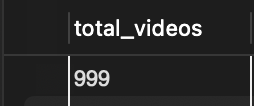
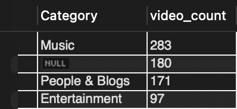
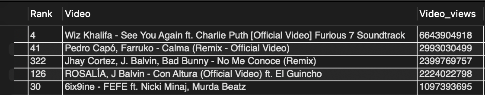
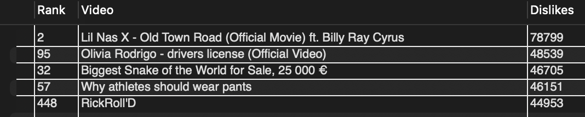
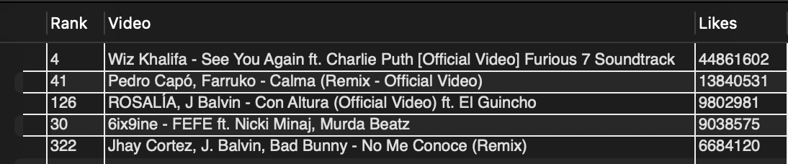
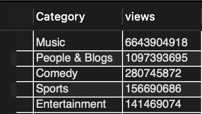
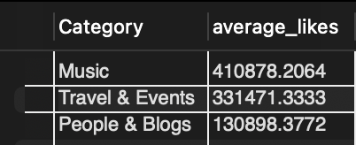
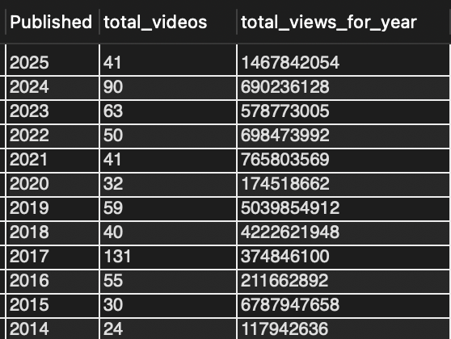
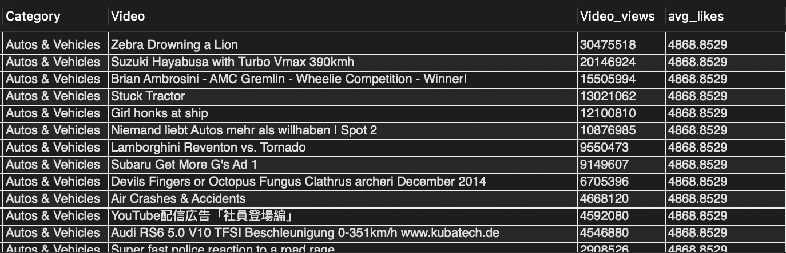
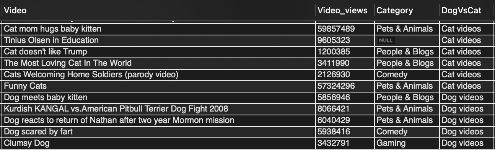

# Welcome to my Youtube Data Analytics Project!!!

## Step 1: Database and Table Setup
After creating the youtube_trends (or any name you prefer) database , we can begin by creating the table and defining the table's columns and their data types as follows: 
```sql
CREATE TABLE Youtube_data (
video_id INT PRIMARY KEY AUTO_INCREMENT,
`Rank` INT,
Video TEXT, 
Video_views VARCHAR(20),
Likes VARCHAR(20),
Dislikes VARCHAR(20), 
Category VARCHAR(50), 
Published INT)
```
Notice how we have backtics (`) when we define the Rank column, that is because RANK is a reserved keyword. Also, notice that even though we have data type for Video_views, likes, dislikes to be VARCHAR(20) even though they represent numeric values. The reason for that is the commas separating the numbers, hence for smooth import of the CSV data into the table, we need to be careful of these things. Therefore, it's really important to take a look at the raw csv file to see what kind of data does the columns contain.

## Step 2: Data Cleaning and Preparation
Firstly, we need to handle leading and trailing whitespace, so we can do the following:
```sql
UPDATE Youtube_data
SET 
    Video = TRIM(Video),
    Video_views = TRIM(Video_views),
    Likes = TRIM(Likes),
    Dislikes = TRIM(Dislikes),
    Category = TRIM(Category);
```
Notice how we've only used TRIM() on String data types such as TEXT and VARCHAR only.
After trimming, if any values were originally blank or just spaces, they might now be empty strings (''). We can set them to NULL (representing missing data) or 0. We'll use NULL here:
```sql
UPDATE Youtube_data SET Video = NULL WHERE Video = '';
UPDATE Youtube_data SET Video_views = NULL WHERE Video_views = '';
UPDATE Youtube_data SET Likes = NULL WHERE Likes = '';
UPDATE Youtube_data SET Dislikes = NULL WHERE Dislikes = '';
UPDATE Youtube_data SET Category = NULL WHERE Category = '';
```
Now, we need to handle the commas within the string columns (Video_views, Likes, Dislikes) and convert them to BIGINT for optimal calculation.
```sql
UPDATE Youtube_data
SET
    Video_views = REPLACE(Video_views, ',', ''),
    Likes = REPLACE(Likes, ',', ''),
    Dislikes = REPLACE(Dislikes, ',', '');
```
Next, we will convert the VARCHAR data type to BIGINT data type since we've trimmed the whitespace and replaced the commas within the values.
```sql
ALTER TABLE Youtube_data
MODIFY COLUMN Video_views BIGINT,
MODIFY COLUMN Likes BIGINT,
MODIFY COLUMN Dislikes BIGINT;
```
Now, with the data cleaning our table looks like this:


## Step 3: Exploratory Data Analysis 
Let's begin with looking at rank and see if we have all the 1000 videos as the csv file says.
```sql
SELECT COUNT(`Rank`) AS total_videos 
FROM youtube_data;
```


This could mean that we're missing a rank or might have duplicate ranks. Also, if we look at our primary key column video_id, we can see that the total number of rows is 999. 


We can check for duplicates:
```sql
SELECT `Rank`, COUNT(*)
FROM youtube_data
GROUP BY `Rank`
HAVING COUNT(*) > 1;
```
It gives no output, which means there are no duplicates. Hence, we can proceed to next step with 999 rows.

Now, let's move our attention towards the Category column. We can use GROUP BY to see how many categories do we have:
```sql
SELECT Category 
FROM youtube_data 
GROUP BY Category;
```
We can use the following queries to see the total number of videos in each category:
```sql
SELECT Category, COUNT(*) AS video_count
FROM youtube_data
GROUP BY Category
ORDER BY video_count DESC;
```


Now, we can see statistics such as top five videos with maximum number of likes, dislikes and views:
```sql
SELECT Video, Video_views
FROM Youtube_data
ORDER BY Video_views DESC 
LIMIT 5;
```

```sql
SELECT `Rank`, Video, Dislikes
FROM Youtube_data
ORDER BY Dislikes DESC 
LIMIT 5;
```

```sql
SELECT `Rank`, Video, Likes
FROM Youtube_data
ORDER BY Likes DESC 
LIMIT 5;
```


We can see which category has the most views by the following query. 
```sql
SELECT Category, 
MAX(Video_views) AS views
FROM Youtube_data
WHERE Category IS NOT NULL
GROUP BY Category DESC
ORDER BY views DESC;
```


Next, we can see categories which got the most amount of average likes:
```sql
SELECT Category, AVG(Likes) AS average_likes
FROM Youtube_data
WHERE Category IS NOT NULL
GROUP BY Category
HAVING AVG(Likes) > 100000
ORDER BY average_likes DESC;
```


Moving on to Publish column, we can see which years had how many videos uploaded and how many views did they get:
```sql
SELECT Video_views, Published, COUNT(*) AS total_videos
FROM Youtube_data
WHERE Published IS NOT NULL
GROUP BY Published
ORDER BY Published DESC;
```


## Step 4: Advanced SQL Techniques for Deeper Insights
If we want to see the average likes of the videos per category, we can use a window function as follows:
```sql
SELECT Category, Video, Video_views, AVG(Likes) OVER(PARTITION BY Category ) AS avg_likes
FROM Youtube_data
WHERE Category IS NOT NULL
ORDER BY Category, Video_views DESC;
```


Further, to find all videos published in 2025 that have achieved at least 1 million views, we can use a CTE(Common table Expression) and compare the tables using JOIN as follows:
```sql
WITH vid_year AS
(
SELECT Video_views, Published
FROM Youtube_Analytics.Youtube_data
WHERE Published = 2025
),
top_video AS 
(
SELECT Video_views, Video
FROM Youtube_Analytics.Youtube_data
WHERE Video_views >= 1000000
)
SELECT * 
FROM vid_year
JOIN top_video 
ON vid_year.Video_views = top_video.Video_views
ORDER BY vid_year.Video_views DESC;
```


We can use CASE statements to see which videos with which animal were trending, dogs or cats?
```sql
SELECT Video, Video_views,  Category ,
CASE
	WHEN LOWER(Video) LIKE '%dog%' THEN 'Dog videos'
    WHEN LOWER(Video) LIKE '%cat%' THEN 'Cat videos'
    ELSE 'Other'
END AS DogVsCat 
FROM Youtube_data
ORDER BY DogVsCat;
```



